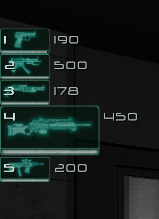

  

Modernizes F.E.A.R. and its expansions with HUD scaling, high-framerate optimizations, XInput controller support, and other quality-of-life enhancements. It aims to be as non-intrusive as possible, with no file modifications and no gameplay changes by default, focusing solely on fixing issues and enhancing the overall experience.

## How to Install
> [!NOTE]  
> Compatible with F.E.A.R. Ultimate Shooter Edition (Steam) and F.E.A.R. Platinum (GOG).  
> All features are compatible with Extraction Point and Perseus Mandate.  
>
> **Download**: [EchoPatch.zip](https://github.com/Wemino/EchoPatch/releases/latest/download/EchoPatch.zip)  
> Extract the contents of the zip file into the game’s folder, in the same directory as the `FEAR.exe` file.

> [!WARNING]
> The GOG version defaults to a 60 FPS cap.  
> To unlock higher framerates, modify the `dxwrapper.ini` file by setting `LimitPerFrameFPS` from **60** to **0**.  
> This change enables compatibility with the `HighFPSFixes` optimizations, ensuring smooth performance at framerates up to 240 FPS.

### Steam Deck/Linux Specific Instructions (Windows users can skip this)
> [!WARNING]
> To launch the game on Steam Deck or Linux, open the game’s properties in Steam and include `WINEDLLOVERRIDES="dinput8=n,b" %command%` in the launch options.
> 
> On Steam Deck, change the controller configuration to `Gamepad With Joystick Trackpad` for XInput support.

# Features

## HUD Scaling
- Dynamically scales HUD elements (texts, crosshair, icons) relative to screen resolution.  
- Adjust `HUDCustomScalingFactor` in `EchoPatch.ini` to customize overall HUD scaling.
- Adjust `SmallTextCustomScalingFactor` for independent scaling of smaller text (e.g., subtitles).

  <table>
    <tr>
      <td width="50%"></td>
      <td width="50%"></td>
    </tr>
    <tr>
      <td align="center">4K Vanilla</td>
      <td align="center">4K EchoPatch</td>
    </tr>
  </table>

> **Note**: The base resolution (1024×768) is used as the reference for scaling, ensuring the HUD retains its original proportions and appearance on all higher resolutions.

## Fix High FPS Issues
Resolves multiple issues at high framerates, designed and optimized for smooth gameplay at up to 240 FPS:
- Ragdoll physics instability above 60 FPS.
- Water physics instability above 120 FPS.
- Excessive water splash effect repetitions above 60 FPS.
- Frozen FX effects above 120 FPS.
- Oversized particles above 120 FPS.
- Overly dampened velocity when jumping out of water above 60 FPS.
- Velocity dampening when jumping and landing above 120 FPS.
- Walking animation prematurely reverting to idle, causing camera stutter above 120 FPS.
- Inability to perform a jump kick above 120 FPS.
- Excessive sliding on sloped surfaces above 60 FPS.

## Weapon Fixes
Addresses several weapon-related issues:
- Zoom disabled when loading a save during a cutscene. 
- Automatic weapons stuck in firing animation when loading a save made mid-fire.
- Weapon cycling not working when there’s an empty slot between two weapons.
- Weapon models not refreshing after loading a save with the same weapon equipped.

> **Note**: These issues were partially fixed in the Extraction Point and Perseus Mandate expansions.

## Framerate Limiter
Prevents the game from running too fast by capping the maximum framerate.  
- **MaxFPS** (`MaxFPS` in `EchoPatch.ini`): Set the maximum framerate. A value of `0` disables the limiter, any other value enables it. The default value of `240` is the recommended safe value, as some high FPS optimizations may not cover higher framerates.  
- **Dynamic VSync** (`DynamicVsync` in `EchoPatch.ini`): When enabled (`1`), VSync synchronizes frame updates to your monitor’s refresh rate, reducing screen tearing. VSync will only be enabled if your monitor’s refresh rate is lower than `MaxFPS`, otherwise it remains off. Set to `0` to disable.  

## Input & Frame Drop Fixes
- **FPS Drop Fix**: Stops the game from initializing all HID devices as a controller to prevent framerate drops over time, rather than intercepting the call as in other fixes.  
- **Input Lag Fix**: Disables the `SetWindowsHookEx` call to reduce input lag.

## XInput Controller Support

| Controller Input                 | Action                         |
|----------------------------------|--------------------------------|
| **Left Analog Stick**            | Move                           |
| **Right Analog Stick**           | Aim                            |
| **Left Analog Stick** (Press)    | Use Health Kit                 |
| **Right Analog Stick** (Press)   | Toggle Flashlight On/Off       |
| **A Button**                     | Jump                           |
| **B Button**                     | Crouch                         |
| **X Button**                     | Reload / Interact / Pick Up    |
| **Y Button**                     | Toggle Slow-Motion             |
| **Right Trigger (RT)**           | Fire                           |
| **Left Trigger (LT)**            | Zoom                           |
| **Right Bumper (RB)**            | Melee                          |
| **Left Bumper (LB)**             | Throw Grenade                  |
| **D-Pad Up**                     | Next Weapon                    |
| **D-Pad Down**                   | Next Grenade                   |
| **D-Pad Left**                   | Lean Left                      |
| **D-Pad Right**                  | Lean Right                     |
| **Back Button**                  | Mission Status                 |

Customizable alongside sensitivity settings within the `[Controller]` section of `EchoPatch.ini`.
> **Note**: Hotplugging is supported, connect or disconnect controllers at any time without restarting the game.  
> **Note**: For a more console-like experience, you can automatically hide the mouse cursor when a controller is detected. This feature is disabled by default. To enable it, set `HideMouseCursor=1` in `EchoPatch.ini`.

## Fix Keyboard Input Initialization
Corrects default control assignment on non‑English layouts by mapping hardware scan codes instead of English key names (preventing some “[unassigned]” entries on first launch or after resetting controls) while leaving the saved bindings in the save file unchanged.

## Widescreen Resolution Support for Extraction Point
Removes 4:3 restriction so all widescreen resolutions are available.

## LAA Patcher
Applies a Large Address Aware patch to allow up to 4 GB of memory (default 2 GB), which can resolve loading issues.  
Disabled by default because it modifies the executable on disk, set `CheckLAAPatch = 1` in `EchoPatch.ini` to enable.  
> **Note**: For the Steam version, running [Steamless](https://github.com/atom0s/Steamless) on `FEAR.exe` before enabling is recommended, but not required.

## Persistent World State
Keeps objects (bodies, blood stains, debris, bullet holes, shell casings, glass shards…) from despawning.

## HD Reflections & Displays
Improves resolution quality of reflective surfaces and displays.

  <table>
    <tr>
      <td width="50%"></td>
      <td width="50%"></td>
    </tr>
    <tr>
      <td align="center">Vanilla</td>
      <td align="center">HD Display</td>
    </tr>
  </table>

## No Model LOD Bias
Renders the highest quality models at all distances by disabling LOD bias.

## Reduced Mipmap Bias
Improves texture sharpness at a distance by reducing mipmap bias.

## Mouse Aim Multiplier
Multiplier applied to mouse aiming to compensate for high sensitivity (does not affect profile settings).  
Set `MouseAimMultiplier` in `EchoPatch.ini` (default `1.0`).

## Disable Letterboxing
Disables cutscene letterboxing when `DisableLetterbox = 1` in `EchoPatch.ini`.

  <table>
    <tr>
      <td width="50%"></td>
      <td width="50%"></td>
    </tr>
    <tr>
      <td align="center">Vanilla</td>
      <td align="center">Letterbox Disabled</td>
    </tr>
  </table>

## Auto Resolution
Automatically sets the game window to match your screen resolution on first launch (or every launch if `AutoResolution = 2`).

## Skip Splashscreen
Bypasses developer splash on launch when `SkipSplashScreen = 1`.

## Skip Movies
Skips intro videos (menu sound retained) when `SkipAllIntro = 1`.  
Individual videos can be skipped via the `SkipIntro` section in `EchoPatch.ini`.

## Save Folder Redirection
Redirects the save folder from `%PUBLIC%\Documents\` to `%USERPROFILE%\Documents\My Games\`.  
Disabled by default, set `RedirectSaveFolder = 1` in `EchoPatch.ini` to enable.

## Infinite Flashlight
Removes battery limit and hides HUD indicator.  
Enable with `InfiniteFlashlight = 1`.

## Weapon Capacity Editor
Customize max weapon capacity via `MaxWeaponCapacity` (0–10).  
Enable with `EnableCustomMaxWeaponCapacity = 1`.  

> **Note:** Weapon capacity is tied to the save data. Lowering the capacity will not take effect on an existing save. Start a new save file to apply a reduced limit.

## dinput8 Chaining Support
Chains another `dinput8.dll` by loading `dinput8_hook.dll` for mod compatibility.

---

## Credits
- [MinHook](https://github.com/TsudaKageyu/minhook) for hooking.  
- [mINI](https://github.com/metayeti/mINI) for INI file handling.  
- [Methanhydrat](https://community.pcgamingwiki.com/files/file/789-directinput-fps-fix/) for identifying the FPS drop root cause.  
- [Vityacv](https://github.com/Vityacv) for identifying the extra latency caused by SetWindowsHookEx.
- [CRASHARKI](https://github.com/CRASHARKI) for the logo.

