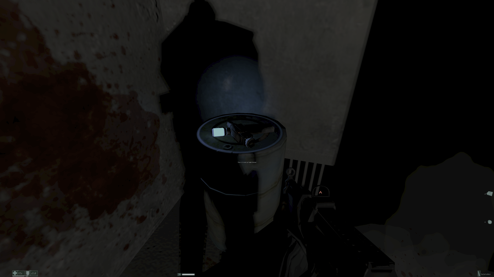
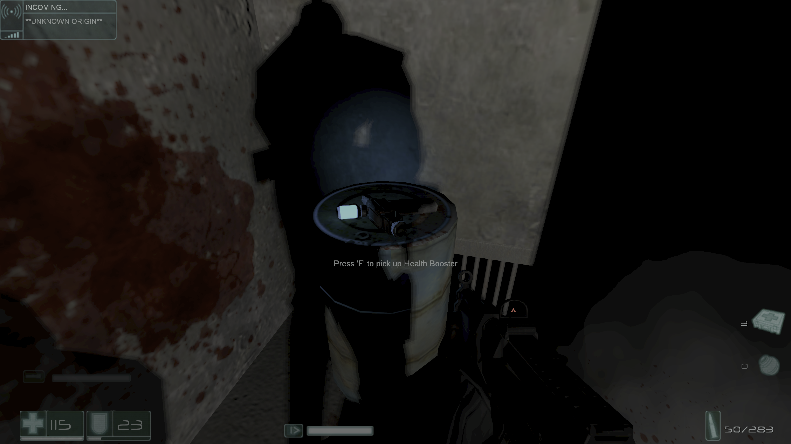
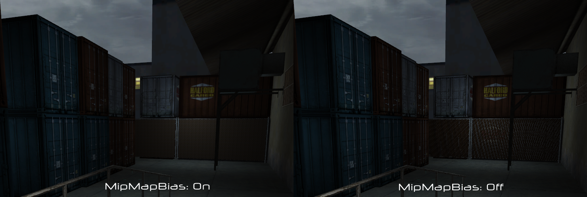
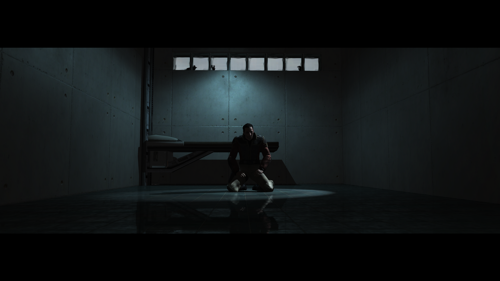
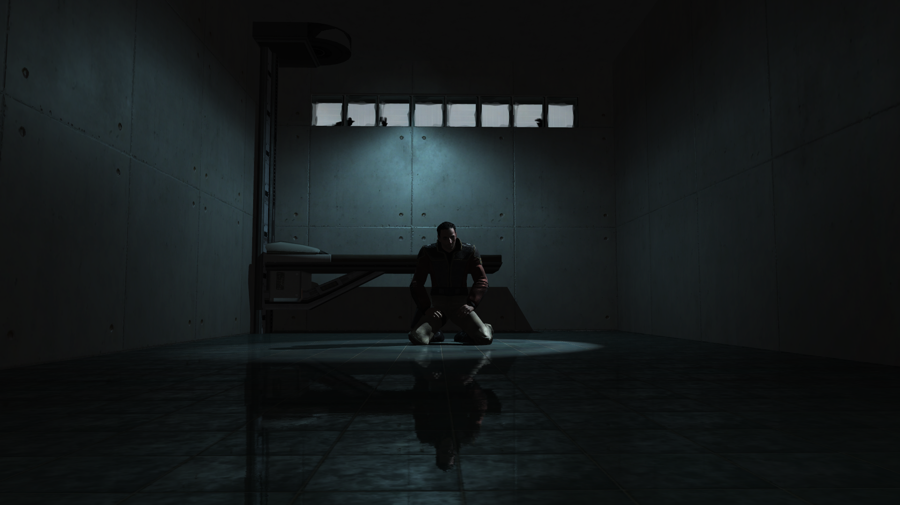

# EchoPatch

Modernizes F.E.A.R. and its expansions with HUD scaling and a variety of enhancements.

## How to Install
> [!NOTE]
> Compatible with F.E.A.R. Ultimate Shooter Edition (Steam) and F.E.A.R. Platinum (GOG).
> 
> All features are compatible with Extraction Point and Perseus Mandate.
> 
> **Download**: [EchoPatch.zip](https://github.com/Wemino/EchoPatch/releases/latest/download/EchoPatch.zip)
>
> Extract the contents of the zip file into the game’s folder, in the same directory as the `FEAR.exe` file.

## Features
 - **HUD Scaling** - This feature dynamically scales HUD elements (such as texts, the crosshair, and icons) relative to the screen resolution. The base resolution is 960x720, ensuring the HUD retains its original proportions and appearance on all higher resolutions.

The `HUDCustomScalingFactor` setting in `EchoPatch.ini` can be adjusted to customize the overall scaling of HUD elements.

|  |  |
|:--:|:--:|
| 4K Vanilla | 4K EchoPatch |

- **Framerate Limiter** - The game engine struggles with very low delta times at high framerates. Since it lacks a framerate cap, this can cause the game to run too fast. This feature lets you set a maximum framerate to prevent that. To adjust the limit, edit `MaxFPS` in `EchoPatch.ini`. A maximum value of 120 is recommended.

- **FPS Drop Fix** - Stop the game from initializing all HID devices, which leads to framerate drops over time. The difference with Methanhydrat's `dinput8.dll` fix is that, rather than intercepting and canceling the problematic call, the call will simply never be executed. This method is specifically effective for F.E.A.R. and does not apply to the other games affected by this issue.

- **No Model LOD Bias** - Forces the highest quality models to be rendered at all distances.

- **No Mipmap Bias** - Forces the highest quality textures to be rendered at all distances.

|  |
|:--:|
| MipMapBias settings: On vs. Off at 1920x1080 |

- **Disable Letterboxing** - Disable the letterbox during cutscenes when `DisableLetterbox` is set to 1 in `EchoPatch.ini`.

|  |  |
|:--:|:--:|
| Vanilla | EchoPatch (Letterbox Disabled) |

- **Widescreen Resolution Support for Extraction Point** – In the Extraction Point expansion, only 4:3 aspect ratio resolutions are shown in the resolution list. This restriction has been removed.

- **Skip Splashscreen** - Bypasses developer splash screen immediately on launch when `SkipSplashScreen` is set to 1 in `EchoPatch.ini`.

- **Skip Movies** - Skips all corporate intro videos while keeping the sound for the menu when `SkipAllIntro` is set to 1 in `EchoPatch.ini`. Additionally, individual videos can be skipped instead of all; refer to the `SkipIntro` section in `EchoPatch.ini`.

## Credits
- [MinHook](https://github.com/TsudaKageyu/minhook) for hooking.
- [mINI](https://github.com/metayeti/mINI) for INI file handling.
- [Methanhydrat](https://community.pcgamingwiki.com/files/file/789-directinput-fps-fix/) for finding the root cause of the FPS drop issue.
