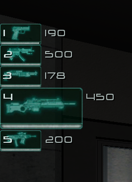

  

Modernizes F.E.A.R. and its expansions with HUD scaling, high-framerate optimizations, controller support, and other quality-of-life enhancements. It aims to be as non-intrusive as possible, applying runtime patches only, with no gameplay changes by default.

## How to Install
> [!NOTE]  
> Compatible with F.E.A.R. Ultimate Shooter Edition (Steam) and F.E.A.R. Platinum (GOG).  
> All features are compatible with Extraction Point and Perseus Mandate.  
>
> **Download**: [EchoPatch.zip](https://github.com/Wemino/EchoPatch/releases/latest/download/EchoPatch.zip)  
> Extract the contents of the zip file into the game's folder, in the same directory as the `FEAR.exe` file.  
> On first launch, EchoPatch will prompt to apply a [LAA patch](#laa-patcher) if needed to prevent loading issues.  
> This prompt will not appear for the GOG version, as the LAA patch is already applied there.

> [!WARNING]
> The GOG version defaults to a 60 FPS cap.  
> To unlock higher framerates, modify the `dxwrapper.ini` file by setting `LimitPerFrameFPS` from **60** to **0**.  
> This change enables compatibility with the `HighFPSFixes` optimizations, ensuring smooth performance at framerates up to 300 FPS.

> [!WARNING]
> **Windows Defender Controlled Folder Access** (rare): If saves or settings are not persisting, Windows Defender may be blocking access to the save folder. Go to **Windows Defender > Controlled Folder Access > Add an allowed app** and add the game executable.

### Steam Deck/Linux Specific Instructions (Windows users can skip this)
> [!WARNING]
> To launch the game on Steam Deck or Linux, open the game's properties in Steam and include `WINEDLLOVERRIDES="dinput8=n,b" %command%` in the launch options.
> 
> On Steam Deck, change the controller configuration to `Gamepad With Joystick Trackpad` for controller support.

# Features

## HUD Scaling
- Dynamically scales HUD elements (texts, crosshair, icons) relative to screen resolution.  
- Adjust `HUDCustomScalingFactor` in `EchoPatch.ini` to customize overall HUD scaling.
- Adjust `SmallTextCustomScalingFactor` for independent scaling of smaller text (e.g., subtitles).

  <table>
    <tr>
      <td width="50%"></td>
      <td width="50%"></td>
    </tr>
    <tr>
      <td align="center">4K Vanilla</td>
      <td align="center">4K EchoPatch</td>
    </tr>
  </table>

> **Note**: The base resolution (1024×768) is used as the reference for scaling, ensuring the HUD retains its original proportions and appearance on all higher resolutions.

## High FPS Fixes
Resolves multiple issues at high framerates, designed and optimized for smooth gameplay at up to 300 FPS (particularly when using Slow-Mo):
- Havok ragdoll physics instability.
- Water physics instability.
- Excessive water splash effect repetitions.
- Frozen FX effects.
- Oversized particles.
- Overly dampened velocity when jumping out of water.
- Velocity dampening when jumping and landing.
- Walking animation prematurely reverting to idle, causing camera stutter.
- Inability to perform a jump kick.
- Excessive sliding on sloped surfaces.
- Slow-motion charge and timer desynchronization.

## Optimized Save Performance
Dramatically reduces save times by buffering file operations in memory instead of writing directly to disk.  
The game performs hundreds of thousands of individual WriteFile calls per save (over 220,000 for a typical 2MB save file), causing multi-second delays even on high-end hardware.

## Fast VRAM Detection
Replaces the slow legacy DxDiag VRAM scan with instant DXGI detection, speeding up startup and performance settings access.

## Input & Frame Drop Fixes
- **FPS Drop Fix**: Prevents framerate drops by stopping the game from initializing all HID devices as controllers.  
- **Input Lag Fix**: Disables the `SetWindowsHookEx` call to reduce input lag.

## Nvidia Rendering Fix
Resolves rendering issues such as shadow flickering and inversion on Nvidia GPUs.  
This issue appeared in Nvidia drivers released after 2015 and persists in modern drivers, with a small performance trade-off for correct shadow rendering.

> **Note**: Can be disabled by setting `FixNvidiaShadowCorruption = 0` in `EchoPatch.ini` if wanted.

## Framerate Limiter
Prevents the game from running too fast by capping the maximum framerate.  
- **MaxFPS** (`MaxFPS` in `EchoPatch.ini`): Set the maximum framerate. A value of `0` disables the limiter, any other value enables it. The default value of `300` is recommended, as minor glitches may occur at uncapped framerates.  
- **Dynamic VSync** (`DynamicVsync` in `EchoPatch.ini`): When enabled (`1`), VSync synchronizes frame updates to your monitor's refresh rate, reducing screen tearing. VSync will only be enabled if your monitor's refresh rate is lower than `MaxFPS`, otherwise it remains off. Set to `0` to disable. 

## Weapon Fixes
Addresses several weapon-related issues:
- Fix Aim/Zoom not working when loading a save during a cutscene.
- Automatic weapons stuck in firing animation when loading a save made mid-fire.
- Weapon cycling not working when there's an empty slot between two weapons.
- Weapon model position not updating correctly after reloading a save with the same weapon equipped.

> **Note**: These issues were partially fixed in the Extraction Point and Perseus Mandate expansions.

## Controller Support

Supports Xbox, PlayStation, and Nintendo Switch controllers via SDL3.

| Controller Input                 | Action                              |
|----------------------------------|-------------------------------------|
| **Left Analog Stick**            | Move                                |
| **Right Analog Stick**           | Aim                                 |
| **Left Analog Stick** (Press)    | Use Health Kit                      |
| **Right Analog Stick** (Press)   | Toggle Flashlight                   |
| **South** (A / Cross)            | Jump                                |
| **East** (B / Circle)            | Crouch                              |
| **West** (X / Square)            | Reload / Interact                   |
| **North** (Y / Triangle)         | Toggle Slow-Motion                  |
| **RT / R2 / ZR**                 | Fire                                |
| **LT / L2 / ZL**                 | Aim / Zoom                          |
| **RB / R1 / R**                  | Melee                               |
| **LB / L1 / L**                  | Throw Grenade                       |
| **D-Pad Up**                     | Next Weapon (Hold: Drop Weapon)     |
| **D-Pad Down**                   | Next Grenade (Hold: Holster Weapon) |
| **D-Pad Left**                   | Lean Left                           |
| **D-Pad Right**                  | Lean Right                          |
| **Back / Share / −**             | Mission Status (Hold: Quick Save)   |
| **Start / Options / +**          | Pause Menu (Hold: Quick Load)       |
| **Share / Capture**              | Holster Weapon                      |
| **Right Paddle 1**               | Center View                         |

> **Note**: Buttons support hold actions for secondary commands. Configure hold bindings and duration via `EchoPatch.ini`. See [COMMANDS.md](https://github.com/Wemino/EchoPatch/blob/master/COMMANDS.md) for the full list of command IDs.

### Rumble
Supports controller vibration feedback.  
Enable with `RumbleEnabled = 1` in `EchoPatch.ini`.

### Gyro Aiming
Enables motion-controlled aiming using the controller's gyroscope for supported controllers (DualShock 4, DualSense, Switch Pro Controller).

Configurable in the `[Controller]` section of `EchoPatch.ini`:
- `GyroEnabled`: Set to `1` to enable gyro aiming.
- `GyroAimingMode`: Determines when gyro is active (`0` = Always On, `1` = Aiming Only, `2` = Hip Fire Only).
- `GyroCalibrationPersistence`: Set to `1` to save calibration data for automatic loading on reconnect if the controller has a unique serial number.

> **Note**: If you experience gyro drift, place the controller on a stable surface for a few seconds to calibrate.

### Additional Feature (PlayStation controllers)
- **Touchpad**: Mouse cursor control (DualShock 4/DualSense)

Customizable alongside sensitivity settings within the `[Controller]` section of `EchoPatch.ini`.
> **Note**: Hotplugging is supported, connect or disconnect controllers at any time without restarting the game.  

Some controller settings from `EchoPatch.ini` can also be adjusted directly in-game via a custom menu accessible from Options → Controls → Configure joystick/gamepad.

  <table>
    <tr>
      <td width="75%"></td>
    </tr>
    <tr>
      <td align="center">Controller Settings Menu</td>
    </tr>
  </table>

## Keyboard Input Fix
Corrects default control assignments on non-English layouts by mapping hardware scan codes instead of English key names. Prevents "[unassigned]" entries on first launch or after resetting controls.

## Widescreen Resolution Support for Extraction Point
Removes 4:3 restriction so all widescreen resolutions are available.

## LAA Patcher
Applies a Large Address Aware patch to allow up to 4 GB of memory (default 2 GB), which can resolve loading issues such as the "Disconnected from server" error.  
The behavior of this option can be edited by setting `CheckLAAPatch` in the `[Fixes]` section of `EchoPatch.ini`.

## Persistent World State
Keeps objects (bodies, blood stains, debris, bullet holes, shell casings, glass shards…) from despawning.

## HD Reflections & Displays
Improves resolution quality of reflective surfaces and displays.

  <table>
    <tr>
      <td width="50%"></td>
      <td width="50%"></td>
    </tr>
    <tr>
      <td align="center">Vanilla</td>
      <td align="center">HD Display</td>
    </tr>
  </table>

## No Model LOD Bias
Disable LOD bias to render models at full quality at any distance.

  <table>
    <tr>
      <td width="50%"></td>
      <td width="50%"></td>
    </tr>
    <tr>
      <td align="center">Vanilla</td>
      <td align="center">No Model LOD Bias</td>
    </tr>
  </table>

## Improved Mipmap Bias
Improves texture sharpness at a distance by reducing mipmap bias. Certain textures such as characters, FX effects, and vehicles are rendered at higher detail, while textures that appear blurry at a distance like fences are selectively rendered at maximum quality. Other textures use a moderate bias to prevent shimmering artifacts.

## Mouse Aim Multiplier
Multiplier applied to mouse aiming to compensate for high sensitivity (does not affect profile settings).  
Set `MouseAimMultiplier` in `EchoPatch.ini` (default `1.0`).

## Custom FOV
Overrides the default 70° field of view and applies automatic viewmodel correction to preserve proper viewmodel proportions at wider FOVs.  
Set `CustomFOV` in `EchoPatch.ini` (0 = disabled).

  <table>
    <tr>
      <td width="50%"></td>
      <td width="50%"></td>
    </tr>
    <tr>
      <td align="center">FOV 95 (No Correction)</td>
      <td align="center">FOV 95 (Corrected)</td>
    </tr>
  </table>

## Disable Letterboxing
Disables cutscene letterboxing when `DisableLetterbox = 1` in `EchoPatch.ini`.

  <table>
    <tr>
      <td width="50%"></td>
      <td width="50%"></td>
    </tr>
    <tr>
      <td align="center">Vanilla</td>
      <td align="center">Letterbox Disabled</td>
    </tr>
  </table>

## Skip Intro
Bypasses startup content for faster game launch.

- `SkipSplashScreen`: Skips the developer splash screen.
- `SkipAllIntro`: Skips all intro videos.

Individual videos can also be skipped via the `[SkipIntro]` section in `EchoPatch.ini`.

## Save Folder Redirection
Redirects the save folder from `%PUBLIC%\Documents\` to `%USERPROFILE%\Documents\My Games\`.  
Disabled by default, set `RedirectSaveFolder = 1` in `EchoPatch.ini` to enable.

## Infinite Flashlight
Removes battery limit and hides HUD indicator.  
Enable with `InfiniteFlashlight = 1`.

## Developer Console
Restores the in-game developer console with a reimplemented frontend using [ImGui](https://github.com/ocornut/imgui), providing access to engine commands and logging messages. Toggle with the Home key.

- `ConsoleEnabled`: Set to `1` to enable the console.
- `DebugLevel`: Controls the verbosity of debug messages (0–15).
- `LogOutputToFile`: Set to `1` to log all console output to a timestamped text file.

  <table>
    <tr>
      <td width="75%"></td>
    </tr>
    <tr>
      <td align="center">Developer Console</td>
    </tr>
  </table>

## EAX Audio Fix
Allows local DirectSound wrappers like [DSOAL](https://github.com/kcat/dsoal) to load correctly, enabling EAX and hardware audio mixing. The game normally uses COM to initialize DirectSound, which bypasses local DLLs and loads the system version instead. This fix intercepts that call and redirects it to the local wrapper.

## Weapon Capacity Editor
Customize max weapon capacity via `MaxWeaponCapacity` (0–10).  
Enable with `EnableCustomMaxWeaponCapacity = 1`.  

> **Note:** Weapon capacity is tied to the save data. Lowering the capacity will not take effect on an existing save. Start a new save file to apply a reduced limit.

## Disable PunkBuster Initialization
Disables initialization of PunkBuster, the deprecated online anti-cheat service that shipped with the original game.  
This prevents the game from loading unused background components.

## dinput8 Chaining Support
Chains another `dinput8.dll` by loading `dinput8_hook.dll` for mod compatibility.

## Configuration
All features can be customized via the `EchoPatch.ini` file. Each setting includes detailed comments explaining its function and acceptable values. The patch uses sensible defaults that work for most users, but allows fine-tuning of every aspect.

---

## Credits
- [SDL3](https://www.libsdl.org/) for controller support.
- [MinHook](https://github.com/TsudaKageyu/minhook) for hooking.  
- [mINI](https://github.com/metayeti/mINI) for INI file handling.
- [ImGui](https://github.com/ocornut/imgui) for the console interface.
- [Methanhydrat](https://community.pcgamingwiki.com/files/file/789-directinput-fps-fix/) for identifying the FPS drop root cause.  
- [Vityacv](https://github.com/Vityacv) for identifying the extra latency caused by SetWindowsHookEx.
- [CRASHARKI](https://github.com/CRASHARKI) for the logo.